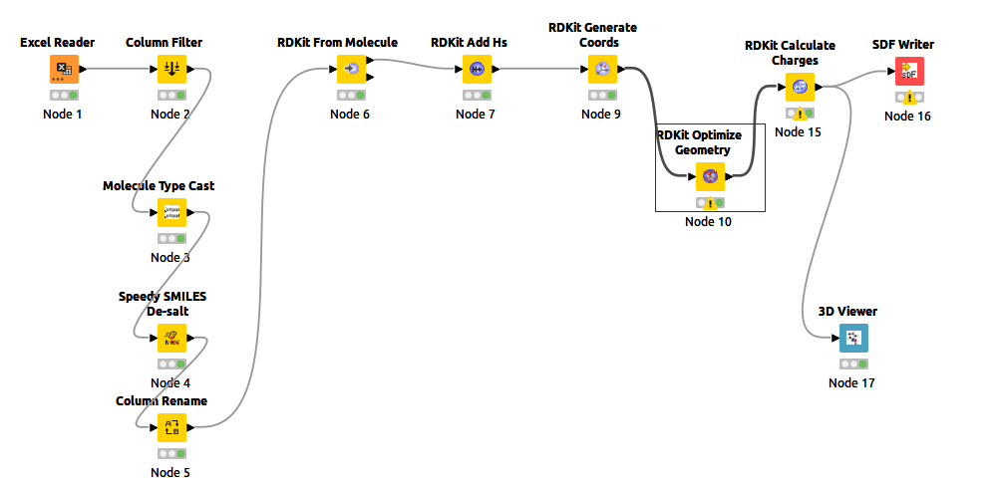

# <p style="text-align: center;"> SCREENING TUTORIALS </p>

**Author**: Thibault Tubiana
**date**: 02/2023  


The purpose of this page is to describe my screening protocol. Please contact me if you find any issue with it or if you want to give your feedback.

# Compile the softwares.

## A. Autodock-GPU
There are several softwares to prepare screening. I've been advised that AUTODOCK-GPU is not that bad.  
After a while, I managed to compile it with the write arguments.

1. First, make surce you have CUDA installed. You can check it with a `which nvcc` command.  Example: 
    ```bash
    ➜ which nvcc
    /usr/local/cuda/bin/nvcc
    ```
    So my cuda installation path is **`/usr/local/cuda/`**

2. Check your compute capability version number : https://developer.nvidia.com/cuda-gpus#compute. For example, for my RTX A6000, the compute capability is **8.6**.  for the `TARGETS` argument in the compiler I will then use **`86`** (if it was 8.0 --> 80...)

```bash
cd ~/softwares #or change it if you want it elsewhere
git clone https://github.com/ccsb-scripps/AutoDock-GPU
cd AutoDock-GPU

#Specify cuda library version BUT REPLACE WITH YOUR LIBRARY PATH
export GPU_LIBRARY_PATH=/usr/local/cuda/lib64   
export GPU_INCLUDE_PATH=/usr/local/cuda/include

#
make DEVICE=CUDA NUMWI=64 TARGETS="86" #86 because compute capability = 8.6

#The softwares are now in ~/softwares/AutoDock-GPU/bin
```
if you want to use MULTIPLE GPU for screening, you can compile with 
```
make DEVICE=CUDA NUMWI=64 TARGETS="86" OVERLAP=on#86 because compute capability = 8.6
```


## B. Autodock TOOLS.
If you want to use a graphical interface to generate the grid and prepare some files, the AutoDockTool is a bit old but still very usefull! You can easilly install it thanks to `conda` in a **sperate environement** (very important since it needs python 2.7 which is deprecated now).

```bash 
conda create -n mgltools -c bioconda mgltools -y
```
To execute AutoDockTool : 
```bash 
conda activate mgltools
adt
```

## C. Autodock classic
The old version of Autodock is still usefull because there is the `autogrid4` software needed to generate important imput files for AutoDock-GPU.

Luckily, nothing to install... Just download the pre-compiled software from https://autodock.scripps.edu/download-autodock4/ : https://autodock.scripps.edu/wp-content/uploads/sites/56/2021/10/autodocksuite-4.2.6-x86_64Linux2.tar

Once done, extract it where you want to install it (for exaple `~/softwares/AutoDock/`)

You can also install it into the mgltools environement
`conda install -n mgltools -c bioconda autodock autogrid`


# Screening! 
## 1. Ligand preparation

First Download the ligands from the supplementary materials (excel files)
Then, Use KNIME to prepare the ligand (see protocol)
1. Read Excel file and keep only the good columns + compound name
2. cast it to a readble molecule format
3. de-salt it (some compound contains salt, like "CL.CCCCCC" meaning that there is a free CL in solution)
4. Rename the column otherwise it wont work...
5. Convert it with RDKIT to a molecule (RDKIT is a very famous opensource chemoinformatic package)
6. Generate a 3D conformation of the molecule
7. Optimize the geometry (very coarse "minimisation") with MMFF94 force field
8. Save it to SDF.

Example :   



## 2. conversion of the molecules

Autodock take only pdbqt format as input.  You have to convert the sdf into pdbqt.  
2 possibilities:

### Using BABEL

For that, you can use `openbabel` to convert it. Openbabel can convert almost everything, even generate 3D format, filter, compute some properties etc....  
During the conversion, I would add the gasteiger charges as well...

**NOTE: DON'T FORGET TO ADD `-xh` TO CONSERVE HYDROGENS... OTHERWISE THEY WILL BE REMOVED. IT'S NOT WHAT YOU WANT**

```bash
obabel -isdf molecules_1-10.sdf -opdbqt -O molecules_1-10.pdbqt --partialcharge gasteiger
```
(if you don't have openbabel installed you can install it with `conda install -c bioconda -c conda-forge openbabel` or `sudo apt install openbabel`)


### Using MEEKO (Better ?)
Meeko is a soft that generate pdbqt from SDF and can generate a SDF from PDBQT.

```bash
conda create -n rdkit -c conda-forge numpy scipy rdkit
pip install prody meeko
```

Then Conversion to PDBQT
```bash
mk_prepare_ligand.py -i MOLECULES.sdf --multimol_outdir OUTPUTFOLDER
```


## 3. Prepare the protein.
1. The protein needs to be prepared as well. For that, the best way is to keep only the chain we want, strip the waters and other molecules.
You can do that in pymol with some commands like : 
    ```pymol
    load protein.pdb
    remove resname HOH
    remove not chain A
    save protein_chainA.pdb
    ```
2. Now we have to add the hydrogens in a "good way". I recommand using propka or directly the pdb2pqr webserver (https://server.poissonboltzmann.org/pdb2pqr).  
You can use the default options for now (I like to tick the option to keep the chain names)

3. Once done, download the pqr file.


## 4. Pocket idenditication (optional)
To identify the pocket, the best option (I think) is to use fpocket (https://bioserv.rpbs.univ-paris-diderot.fr/services/fpocket/).   
Per default, you can submit a pdb file and look at the possible pocket. There is a druguability score from 0 to 1 that can be used to find hypothetical droguable pockets.


## 5. Prepare the grid and the protein of the docking.
The next step is to prepare the docking grid. There is two option : 
- Set a grid around the hypothetical binding pocket
- set a grid around the whole protein.

In either case, you can prepare it with autodock tools (inside the `mgltools` environment. You can activate it with `conda activate mgltools` and then run adt with `adt` command)

1. In the grid menu go to `Macromolecule > Open Macromolecule` and load your pqr file (in filter, choose `all files` if it is in pqr format instead of pdbqt)
2. Usually, autodock works great with gasteiger charges. Say "yes" when adt ask if you want to add gasteiger charges.
3. Let AutodockTools prepare the protein (ie, calculate the gasteiger charges + Merging non-polar hydrogens) and **save the protein in pdbqt format**
4. Set the maps type :  
  Map types are important because the calculations are made based on a potential map. You have to create a map for each atom types!
  Usually, 
   - `Grid > Set Map Type > Directly`
   - write those atoms name `A Br C HD N NA OA SA Cl S F I P`. Some atoms name might be missing (if you want all atoms name check the file `input/7cpa/derived/AD4.1_bound.dat` in autodock-GPU repository)
5. Set the grid box
    - `Grid > Grid box`
    - Changes the values to ajust the docking box. 
    - **If you dock on the whole protein** : Change the spacing to 0.5 or 1 depending the size of the protein.
    - **save it before closing it** : `File > Close Saving Current`
6. Save the grid file : `Grid > Output > Save GPF`
7. Prepare all MAP.FLD file for the docking with autodock-grid : `~/softwares/AutoDock/autogrid4 -p FILE.gpf`


## 6. SCREEEENING!!
Now that the protein is prepared, and the molecules as well, it it time to screeeen!  
The following screening is made with autodock-gpu. The idea is to "screen" very fastly, and then re-dock best compounds with flexible residues [NOTE FOR TT -> TODO].

**NOTE**: If you open the .fld file and .gpf file you will notice that it countains the name of the prepared protein. It means that when you run autodock, all file have to be located at the right place!!!

1. Check that all files are there and path in FLD file point to the right file
2. Generate a file list with **ALL** the ligands you wanna screen. You can do that in python for example. It has to follow a specific format 
    ```
    PATH_TO_PLD_FILE
    ligand1.pdbqt
    NAME 1
    ligand2.pdbqt
    NAME 2
    ```
    Example: 
    ```
    receptor_prepared.maps.fld
    ./molecules/TCMDC-140876.pdbqt
    TCMDC-140876
    ./molecules/TCMDC-124866.pdbqt
    TCMDC-124866
    ```
    You can use this python code for example 
    ```python
    import os
    import glob
    from pathlib import Path

    molecules = glob.glob("molecules/*.pdbqt")
    with open("molecules_list.list","w") as output:
        output.write("WRITE_YOUR_FLD_FILE_HERE\n")
        for mol in molecules:
            name = Path(mol).stem
            output.write(f"./{mol}\n")
            output.write(f"{name}\n")

    ```
3. Now run the screening!!!  
`time ~/softwares/AutoDock-GPU/bin/autodock_gpu_256wi --filelist molecules_list.list -nrun 300 -D all > screening.log`  
  please note that redirecting the output of autodock_gpu is important because you can track the best energy directly.

# NOT SORTED STUFFS


## Flexible residues... (only during testing, to be removed)
Flexible residues : 
- GLU69; ASN73; LYS75; HIS79; MET80; ASP84; PHE87; TYR88

BOX: 
- Number of points:
  - X: 42
  - Y: 40 
  - Z: 74
- Center grid
  - X: 6.665
  - Y: 27.642
  - Z: -3.689
- offset
  - X: 6.667
  - Y: 27.639
  - Z: -3.667

## Define the number of atoms in all pdbpyqt
If use this code to read all ligand file, get the `ATOM` lines and check the `ATOMTYPE` column.  
This is needed to know which atom type are present to prepare the grid for the screening.

I leave the code, but I think this definition is enough for most of the ligand: `A Br C HD N NA OA SA Cl S F I P`.  

CHECK ALL ATOMTYPES : `./input/7cpa/derived/AD4.1_bound.dat`
If you want to update this list with your ligand list, use this bellow.

```python
import pandas as pd
import glob
from tqdm.notebook import tqdm
import numpy as np

os.chdir("/home/thibault/work/projects/other/Sylvie/new_test/molecules")
filelist = glob.glob("./*.pdbqt")

atom=[]
for file in tqdm(filelist):
    with open(file,"r") as filin:
        lines = filin.readlines()
        for line in lines:
            try:
                if line.startswith("ATOM"):
                    atomType= line[77:80].strip()
                    atom.append(atomType)
            except:
                pass

print (np.unique(np.asarray(atom)))
```

# DLG TO PDBQT
To convert DLG to PDBQT in one command you can use  
```bash
 grep ^DOCKED results.dlg | cut -c 9- > docked.pdbqt
```
or (better)
```bash
obabel -ipdbqt TCMDC-124963.dlg -opdbqt -O test.pdbqt -ad
```
NOTE: the `-ad` precise the `d` argument for the `pdbqt` READING format. (check https://openbabel.org/docs/current/FileFormats/AutoDock_PDQBT_format.html#read-options and https://openbabel.org/docs/current/FileFormats/Overview.html for how to give input/output arguments).


## Get the best energy from logfile
```python
import re

reg = re.compile(r"(B|b)est energy +(-\d+\.\d+) kcal\/mol")

os.chdir("/home/thibault/work/projects/other/Sylvie/new_test")
logfile = "screening.log"

with open(logfile,"r") as infile:
    ligands = []
    energies = []
    for line in infile.readlines():
        if line.strip().startswith("Ligand file"):
            ligandname = line.split("/")[-1].split(".")[0] #Get the ligand name
            ligands.append(ligandname)
        match = reg.findall(line)
        if len(match) > 0:
            energy = float(match[0][1])
            energies.append(energy)

if len(energies) == len(ligands):
    import pandas as pd

    d = {
        "Molecule":ligands,
        "Best Energy (kcal/mol)":energies
        }
    results = pd.DataFrame.from_dict(d)
    results = results.sort_values("Best Energy (kcal/mol)")
    results.to_csv("results.csv")

else:
    print("mismatch in len)")

```


## Extract the energy from XML files
```python
import pandas as pd
import glob
from pathlib import Path
#Don't forget to install lmxl

filelist = glob.glob("./test062223/*.xml")
molecules = []
energiesMin = []
energiesAve = []
for file in filelist:
    name = Path(file).stem 
    molecules.append(name)
    results = pd.read_xml(file, xpath="//runs/run",namespaces={"autodock-gpu":"runs"})
    energiesMin.append(results.free_NRG_binding.min())
    energiesAve.append(results.free_NRG_binding.mean())

results = pd.DataFrame.from_dict(
    {
        "molecule":molecules,
        "energyMin":energiesMin,
        "energyAve":energiesAve,
    }
)


```
